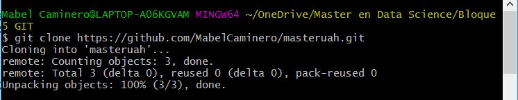

# masteruah

1.	Repositorio masteruah 

2. Clonar repositorio en local

3. Crear en repositorio local un documento README.md
3. Añadir a README.md los comandos hasta ahora y usar commit con mensaje commit inicial

4. Push inicial. Subir los cambios al repositorio remoto

5. Ignorar archivos

6. Añadir fichero 1.txt

7. Crear tag v0.1
8. Subir tag v.01

9. Foto de perfil 

10. Poner doble factor de autentificación

